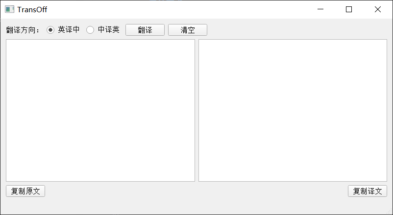

# TransOff - 离线翻译工具

TransOff 是一个基于 MarianMT 模型的离线翻译工具，支持中英文互译。该工具可以在没有网络连接的情况下进行高质量的翻译工作。

## 功能特点

- 🌐 **完全离线**：基于 MarianMT 模型，无需网络连接即可翻译
- 🖥️ **系统托盘运行**：启动后最小化到系统托盘，不占用桌面空间
- ⌨️ **快捷键操作**：支持多种快捷键快速翻译和操作
- 📋 **选中文本翻译**：可直接翻译其他应用中选中的文本
- 🔄 **实时翻译**：输入文本后自动翻译或手动触发翻译

## 系统要求

- Windows 7/8/10/11
- Python 3.7+
- 至少 2GB 可用内存

## 安装依赖

```bash
pip pip install PyQt5 transformers torch sentencepiece sacremoses pyperclip pynput
```

## 模型准备

需要下载 MarianMT 中英翻译模型到 ./models/ 目录：

1. 创建目录结构：

>models/  
>├── en2zh/  
>└── zh2en/

下载对应的 MarianMT 模型文件到相应目录

[Helsinki-NLP/opus-mt-en-zh](https://hf-mirror.com/Helsinki-NLP/opus-mt-en-zh/tree/main)

[Helsinki-NLP/opus-mt-zh-en](https://hf-mirror.com/Helsinki-NLP/opus-mt-zh-en/tree/main)

[gitcode]https://ai.gitcode.com/mirrors/Helsinki-NLP/opus-mt-zh-en/tree/main

[gitee]https://ai.gitee.com/hf-models/Helsinki-NLP/opus-mt-zh-en

## 快捷键说明

全局快捷键（在任何应用中都可使用）

- Ctrl + 1：获取选中文本并进行英译中翻译

- Ctrl + 2：获取选中文本并进行中译英翻译


应用内快捷键（TransOff 窗口激活时）

- Ctrl + Enter：手动触发翻译

- Alt + C：复制原文内容

- Alt + V：复制译文内容

- Alt + Q：清空输入和输出内容

## 使用方法

### 启动程序

运行程序后，程序会自动最小化到系统托盘，不会显示主窗口。


### 唤醒窗口

1. 快捷键唤醒：使用 `Ctrl + 1` 或 `Ctrl + 2` 自动唤醒窗口并翻译选中文本

2. 托盘图标唤醒：点击系统托盘中的 `TransOff` 图标或右键选择"显示窗口"

## 翻译操作

1. 选中文本翻译：

   - 在其他应用中选中需要翻译的文本

   - 按 `Ctrl + 1`（英译中）或 `Ctrl + 2`（中译英）

   - 程序自动获取选中文本并显示翻译结果

2. 手动输入翻译：

   - 唤醒 TransOff 窗口

   - 在左侧输入框中输入需要翻译的文本

   - 点击"翻译"按钮或按 Ctrl + Enter 进行翻译

   - 翻译结果会显示在右侧输出框中

### 界面操作

- **切换翻译方向**：点击"英译中"或"中译英"单选按钮

- **手动翻译**：点击"翻译"按钮

- **清空内容**：点击"清空"按钮或按 `Alt + Q`

- **复制原文**：点击"复制原文"按钮或按 `Alt + C`

- **复制译文**：点击"复制译文"按钮或按 `Alt + V`

## 界面说明



## 注意事项

1. **首次启动**：第一次运行时需要加载模型，可能需要一些时间

2. **内存占用**：程序运行时会占用一定内存来保持模型加载

3. **模型路径**：确保模型文件放置在正确的路径下

4. **输入法支持**：支持中文输入，确保系统输入法配置正确

## 日志文件

程序运行时会生成日志文件 `translator.log`，可用于调试和问题排查。

## 版本信息

当前版本：1.0.0

## 许可证

MIT License